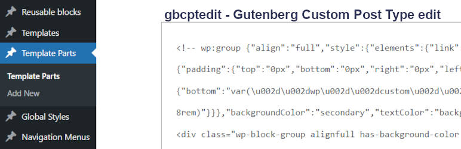

# gbcptedit 

* Contributors: bobbingwide
* Donate link: https://www.oik-plugins.com/oik/oik-donate/
* Tags: oik, plugin, unloader
* Requires at least: 5.8.2
* Tested up to: 6.4.1
* Stable tag: 0.0.2

Enable editing of Gutenberg's Custom Post Type's content.

## Description 
Gutenberg Custom Post Type Edit ( gbcptedit ) is a simple plugin to enable editing of the Custom Post Types created by the Gutenberg plugin, which are now part of WordPress 5.9

The Gutenberg block editor created a number of new Custom Post Types:

CPT | Description
--- | -------
wp_block | Reusable blocks
wp_template | Templates to include in your theme
wp_template_part | Template parts to include in your templates
wp_global_styles | Global styles to include in themes
wp_navigation | Navigation menus

These post types are not normally available for public inspection and/or editing.

Developers and advanced users of Gutenberg blocks and Full Site Editing themes may have tools that can be used to manually alter the
post type definitions to enable viewing of the post contents. I use my oik-types plugin to do this.

For each development environment it's a manual process to define the CPT overrides.
I'm currently debugging what should be a simple problem associated with the new CPT `wp_navigation`.
It would be a lot easier if I could simply install and activate a plugin that automates the manual process,
plus the extra logic that I've added to my Fizzie FSE theme.

Use the gbcptedit plugin to enable editing of Gutenberg's Custom Post Types
using your editor of choice.

This can come in very handy during:

- Full Site Editing theme development
- Problem determination

If your site has multiple users you may want to limit this plugin's use to your development environment.

## Installation 
1. Upload the contents of the gbcptedit plugin to the `/wp-content/plugins/gbcptedit' directory
1. Activate the gbcptedit plugin through the 'Plugins' menu in WordPress

## Frequently Asked Questions 

# What is this plugin for? 
To enable you to see what Gutenberg's created without having to resort to phpMyAdmin.
Just view the content in the editor.

## Screenshots 
1. None

## Upgrade Notice 
# 0.0.2 
Update for support for PHP 8.1 and PHP 8.2

# 0.0.1 
Update so that the Gutenberg CPT's don't have Custom Navigation link variations created for them

# 0.0.0 
Prototype version to avoid manual configuration using oik-types.

## Changelog 
# 0.0.2 
* Changed: Add PHPUnit test for PHP 8.1 and PHP 8.2 #2
* Tested: With WordPress 6.4.1
* Tested: With Gutenberg 17.0.2
* Tested: With PHP 8.1 and PHP 8.2
* Tested: With PHPUnit 9.6

# 0.0.1 
* Changed: Set show_in_nav_menus to false
* Tested: With WordPress 5.9-RC3
* Tested: With Gutenberg 12.4.0

# 0.0.0 
* Added: Brand new plugin.
* Tested: With WordPress 5.8.2 and WordPres 5.9-RC2 and WordPress Multi Site
* Tested: With Gutenberg 12.3.2
* Tested: With PHP 8.0
